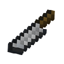
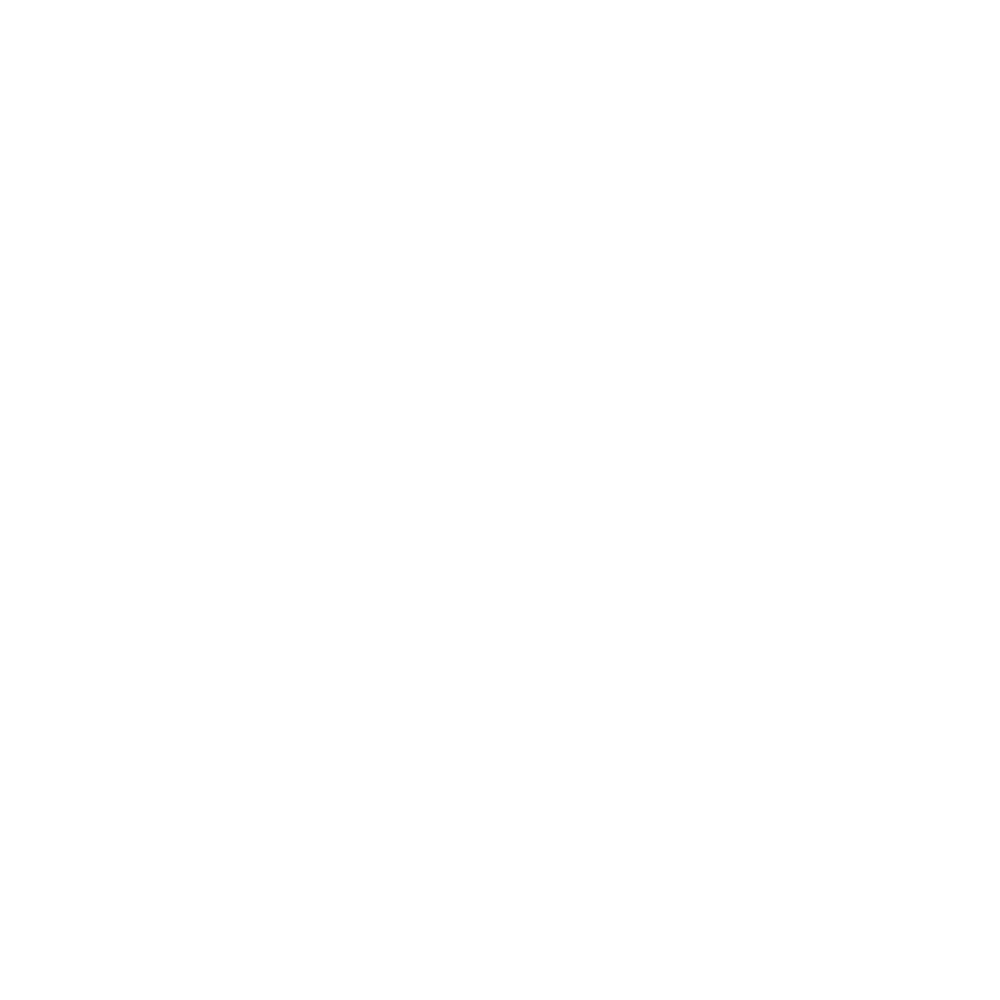

# 

**A cooking overhaul for NeoForge 1.21**
 
**New crops, a multi-slot grill table, a skillet, a cutting board, and fillable vessels.**

---

## Overview

**Dice & Delish** adds a small but deep cooking loop to Minecraft: grow your own produce, work a hand-fed **Grill
Table** and **Skillet**, dice and slice ingredients on a **Cutting Board** with a full knife tier line, and fill a
reusable **Iron Cup** with milk, yogurt, strawberry yogurt, or raw egg liquid. Everything is built data-driven on
top of vanilla systems (custom recipe types, data components, and datagen for
`recipes/loot/tags/advancements/language`),
so the mod stays lightweight and easy to extend or add compatibility for.

## Features

### 🔥 The Grill Table

- An 8-slot cooking block: 4 dedicated **grill slots** driven by a custom cook recipe type, plus 4 **campfire slots**
  that reuse vanilla campfire recipes - cook two different ways on the same block.
- **Regular** and **Soul** variants - the Soul Grill Table burns with a bonus cooking-speed multiplier.
- Place a hay bale nearby for a cooking-speed boost.
- Putting out a lit Grill (water, or a Shovel at the cost of 1 durability) now leaves behind a proper **Unlit
  Grill**/ **Unlit Soul Grill** block - relight it in place with Flint and Steel, a Fire Charge, or a flaming arrow,
  or craft a fresh one with Blaze Powder (add Soul Sand/Soil to get the Soul variant instead).
- Directional placement, waterloggable, ignites from lava, and lights up when active.
- Custom block entity renderer with animated food items, sizzle particles, and looping grill audio for full sensory
  feedback.

### 🍳 The Skillet

- A compact frying station: cook a single **Egg** alone, or drop in **Cut Potato** or **Cut Purple Onion** while it
  cooks to turn it into a **Potato** or **Purple Onion Tortilla** instead.
- Right-click an empty Iron Cup against a Skillet holding raw egg to draw off **Egg Liquid** - pour a filled Egg Cup
  back onto an empty Skillet to return it.
- Runs hot: stepping on an active Skillet burns whoever's careless enough to do it.
- Its own block entity renderer and looping sizzle audio, plus a dedicated Jade tooltip showing egg count and
  remaining cook progress.

### 🔪 The Cutting Board & Knives

- Place a cuttable ingredient on the **Cutting Board**, then cut it with a knife to produce prep items like Cut
  Potato, Cut Purple Onion, diced raw chicken, or sliced cheese.
- A complete knife tier line: **Stone, Iron, Gold, Diamond, Obsidian, and Netherite** (Netherite via smithing
  upgrade, Obsidian backed by a new dedicated tool tier).
- Its own block entity renderer, and rendered at reduced detail past configurable chunk-distance tiers alongside the
  Grill Table, easing load in large builds and farms.

### 🌱 Crops

- **Strawberry**, **Tomato**, **Lettuce**, **Purple Onion**, and **Rice** - each with dedicated seeds, block states,
  and growth stages.
- Tomatoes grow on a **trellis/pole** mechanic for a more realistic garden layout.
- **Wild variants** of every crop can be found generating naturally in the world, harvested for a small snack or to
  kickstart your first farm - no starter seeds required.

### 🥛 The Iron Cup

- A reusable, refillable vessel instead of a single-use container.
- Fill it with **milk** straight from a cow, then turn it into **yogurt** or **strawberry yogurt** through dedicated
  mixing/cup-crafting recipes - or draw raw **egg liquid** off a cooking Skillet and pour it back later.
- Content is tracked via a proper data component, so each fill state has its own name, food values, and model - and JEI
  treats each as a distinct entry automatically.

### 🍳 New Foods & Recipes

- Raw & cooked chicken pieces, cut potato & purple onion, fried egg, tortillas (plain, potato, purple onion), rice &
  rice bowl, cheese & sandwiches (raw and toasted), grilled cheese, salad, milk, yogurt, and strawberry yogurt.
- Custom recipe types: grill cooking, skillet cooking, cutting, mixing, and shapeless cup crafting (with a dedicated
  ingredient type for cup contents).
- A full data-driven backend: recipes, loot tables, item/block tags, advancements, biome/placed features for crop
  world-gen, and sound definitions are all generated, not hand-authored per platform.

### 🌍 Built-in Localization

- Ships with **English (en_us)** and **Spanish (es_es)** translations out of the box.

## Installation & Requirements

| Requirement | Version                                            |
|-------------|----------------------------------------------------|
| Minecraft   | `1.21-1.21.3`                                      |
| Mod Loader  | [NeoForge](https://neoforged.net/) `21.X` or later |
| Java        | `21+`                                              |

1. Install [NeoForge](https://neoforged.net/) `21.X` or later for Minecraft 1.21-1.21.3.
2. Download the latest **Dice & Delish** jar from [Modrinth](https://modrinth.com/mod/diceanddelish)
   or [CurseForge](https://www.curseforge.com/minecraft/mc-mods/diceanddelish).
3. Drop the jar into your `mods/` folder.
4. (Optional) Install [JEI](https://modrinth.com/mod/jei/versions?l=neoforge)
   and/or [Jade](https://modrinth.com/mod/jade/versions?c=release&g=neoforge) for the integrations described
   below.
5. Launch the game.

> This mod is a **client + server** mod - install it on both sides for multiplayer.

> ⚠️ **Upgrading from NerdSoft Kitchen (pre-1.0.0)?** The mod ID and every registry name changed as part of the
> rename to Dice & Delish. Blocks/items placed under the old `nerdsoftkitchen` ID will not carry over automatically -
> back up your world first, and expect to need a rename/migration data fix (or a fresh start) on existing saves.

## Configuration & Integration

### JEI (Just Enough Items)

Optional, client-side. When installed, Dice & Delish registers:

- Dedicated **Grill Cooking**, **Skillet**, and **Cutting** recipe categories showing every custom recipe alongside
  its required catalyst, with explicit sort ordering between them.
- Subtype support for the Iron Cup, so each fill state (empty, milk, yogurt, strawberry yogurt, egg liquid) shows up
  and searches as its own distinct item.
- Recipes now reliably register after loading into a world - a previous bug where JEI's runtime callback could fire
  before any level was loaded (silently skipping registration) has been fixed.

### Jade

Optional, client-side. When installed, hovering over an active **Grill Table** or **Skillet** shows an interactive
tooltip with the items currently cooking inside - including egg count and remaining progress for the Skillet - no
need to open a GUI to check progress.

### Data Components

Iron Cup contents are implemented as a
first-class [data component](https://docs.neoforged.net/docs/1.21.1/items/datacomponents/), not NBT or metadata - this
keeps stacking, tooltips, and JEI/Jade integration consistent and future-proof against further additions.

No config file is required; all tuning currently lives in the datapack (recipes, loot tables, tags).

## Screenshots

 

## Contribution Guidelines

Contributions are welcome for **bug reports, translations, and datapack-side content** (recipes, loot tables, tags).

1. **Bugs & suggestions:** open a [GitHub Issue](https://github.com/PanzerOrg/Panzer-Kitchen/issues) with your
   Minecraft/NeoForge/mod version, a log if relevant, and steps to reproduce.
2. **Pull requests:** open an issue first to discuss the change before investing time in a PR - this keeps effort
   aligned with where the project is headed, and avoids duplicate work.
3. **Translations:** language files live under `src/main/java/.../datagen/ModEnUsLanguageProvider.java` and
   `ModEsEsLanguageProvider.java` (datagen-based, not raw JSON) - open an issue to propose or contribute a new language.
4. **Dev environment:** standard NeoForge Gradle userdev setup - `./gradlew runData` and then `./gradlew runClient` to
   generate assets and launch.

Please be respectful and constructive when opening issues or discussing changes.

## Authors & Credits

* **Author:** Vishal Torres Nun ([@Bichal](https://github.com/Bichal))
* **Credits:** Hugo Escribano Moreno ([@HugoBeshugoXD](https://github.com/HugobesugoXD))

## License

Dice & Delish uses a **dual-license model**:

| Content                             | License                                                                                                                              |
|-------------------------------------|--------------------------------------------------------------------------------------------------------------------------------------|
| Source code (Java, Rust, C++)       | [GNU Affero General Public License v3.0 (AGPLv3)](https://www.gnu.org/licenses/agpl-3.0.html) - see [`LICENSE-AGPL`](./LICENSE-AGPL) |
| Artwork, logos, and branding assets | [CC BY-NC-SA 4.0](https://creativecommons.org/licenses/by-nc-sa/4.0/) - see [`LICENSE-CC`](./LICENSE-CC)                             |

### Source Code (AGPLv3)
- **Share & Adapt** - You're free to study, modify, and redistribute it under AGPLv3 terms.
- **Network copyleft** - If you run a modified version as a network service, you must make your modifications' source available to users of that service.

### Artwork, Logos, & Assets (CC BY-NC-SA 4.0)
- **Attribution** - You must credit the original authors ([@Bichal](https://github.com/Bichal) & [@HugoBeshugoXD](https://github.com/HugobesugoXD)) and link back to this repository.
- **NonCommercial** - No selling the assets or derivatives, or using them commercially, without explicit permission.
- **ShareAlike** - If you remix, transform, or build upon the material, you must distribute your contributions under the same license.

See [`LICENSE`](./LICENSE) for the full summary and links to both license texts, or open an issue if you'd like to discuss usage outside these terms.

---

Made by <a href="https://github.com/PanzerDevOrg">Panzer</a> 

